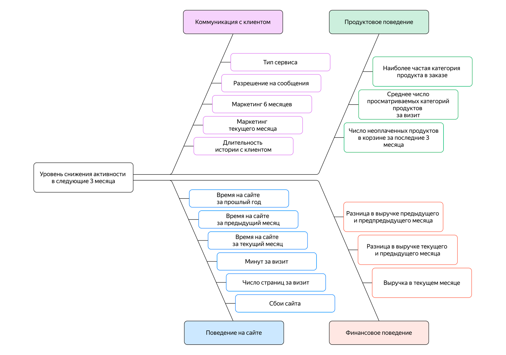

# Проект: Обучение с учителем: качество модели

## Описание проекта

Интернет-магазин «В один клик» продаёт разные товары: для детей, для дома, мелкую бытовую технику, косметику и даже продукты. Отчёт магазина за прошлый период показал, что активность покупателей начала снижаться. Привлекать новых клиентов уже не так эффективно: о магазине и так знает большая часть целевой аудитории. Возможный выход — удерживать активность постоянных клиентов. Сделать это можно с помощью персонализированных предложений.

«В один клик» — современная компания, поэтому её руководство не хочет принимать решения просто так — только на основе анализа данных и бизнес-моделирования. У компании есть небольшой отдел цифровых технологий, и вам предстоит побыть в роли стажёра в этом отделе. 

Итак, вашему отделу поручили разработать решение, которое позволит персонализировать предложения постоянным клиентам, чтобы увеличить их покупательскую активность.

# Что нужно сделать

 - Нужно промаркировать уровень финансовой активности постоянных покупателей. В компании принято выделять два уровня активности: «снизилась», если клиент стал покупать меньше товаров, и «прежний уровень».
 - Нужно собрать данные по клиентам по следующим группам:
    - Признаки, которые описывают коммуникацию сотрудников компании с клиентом.
    - Признаки, которые описывают продуктовое поведение покупателя. Например, какие товары покупает и как часто.
    - Признаки, которые описывают покупательское поведение клиента. Например, сколько тратил в магазине.
    - Признаки, которые описывают поведение покупателя на сайте. Например, как много страниц просматривает и сколько времени проводит на сайте.

Представим группы признаков (вместе с целевым) в виде диаграммы — такую визуализацию ещё называют диаграммой Исикавы.

 - Нужно построить модель, которая предскажет вероятность снижения покупательской активности клиента в следующие три месяца.
 - В исследование нужно включить дополнительные данные финансового департамента о прибыльности клиента: какой доход каждый покупатель приносил компании за последние три месяца.
 - Используя данные модели и данные о прибыльности клиентов, нужно выделить сегменты покупателей и разработать для них персонализированные предложения.

# Модели используемые в ходе проекта

 - sklearn.linear_model - LogisticRegression
 - sklearn.neighbors - KNeighborsClassifier
 - sklearn.tree - DecisionTreeClassifier
 - sklearn.svm - SVC

# Результаты

 - Провели тестирование четырех моделей:
     - KNeighborsClassifier(),
     - DecisionTreeClassifier(),
     - LogisticRegression(),
     - SVC()
 - Для каждой модели тестировали разные наборы гиперпараметров используя GridSearchCV (осуществляет перебор по сетке, все указанные значения гиперпараметров будут перебираться): 
     - cv=5 - 5 этапов кросс-валидации (5 итераций обучения и валидации на разных выборках)
     - scoring='roc_auc' - оптимальаня метрика для сравнения результатов бинарной классификации - площадь фигуры под графиком
 - В качестве лучшей модели выбираем SVC() с гиперпараметрами C=0.001, probability=True, random_state=42.